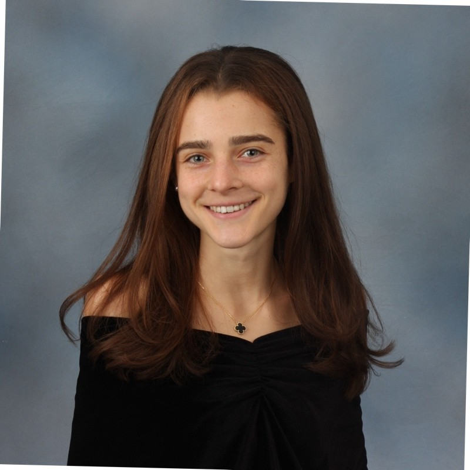
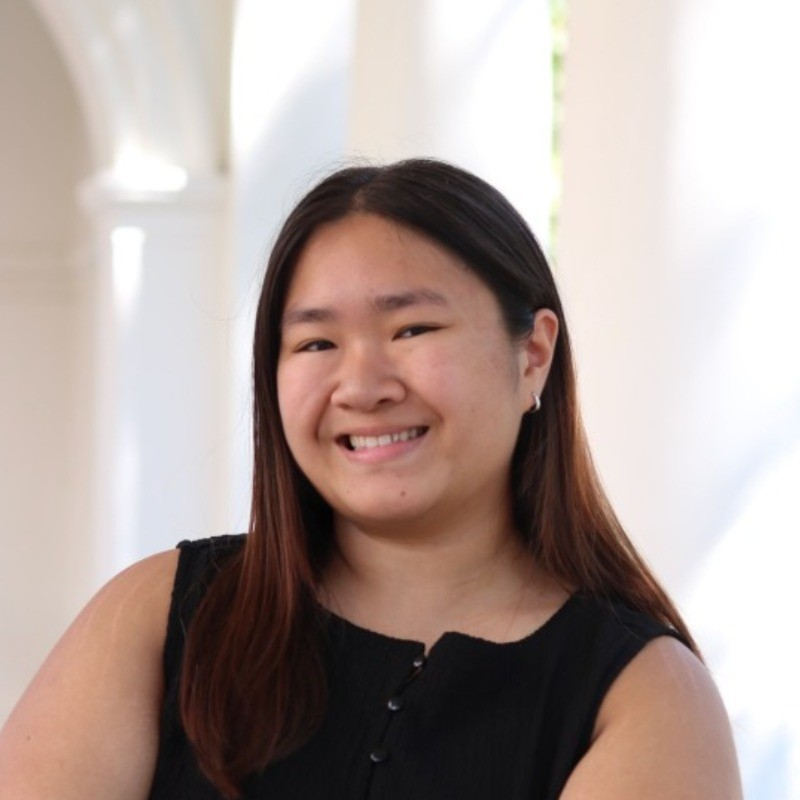

 Simulation and Modelling (SYS 3062)

#### SYS3062: Modelling and Simulation | Spring 2025

   

Professor: [**Henning S Mortveit**](https://engineering.virginia.edu/faculty/henning-s-mortveit) (Henning.Mortveit at virginia.edu), Office Hours: TBD in Olsson 102A Thur TBD on TBD

Lab Instructor: [**Gabriel (Gabe) Lawrence**](https://www.linkedin.com/in/gabriel-lawrence-ort1/) (gabeL at virginia.edu), Office Hours: TBD in Olsson TND, Thur 10:30am-12pm on Zoom.

Undergraduate/ME Teaching Assistant: [**Madeline (Maddie) Priebe**](https://www.linkedin.com/in/madeline-priebe-302386224) (map7cma at virginia.edu), Office Hours: Tue TBD in TBD Fri 10am-11:30am on TBD.

Undergraduate Teaching Assistant: [**Tracy Hua**](https://www.linkedin.com/in/tracy-hua/) (njn4gb at virginia.edu), Office Hours: Wed TBD in Olsson TBD.

Undergraduate Teaching Assistant: [**TBD**](https://example.com) (mcu2xn at virginia.edu), Office Hours: Fri TBD in Link Lab 225.

Class Time: Monday and Wednesday between 2PM and 3:15PM (ET).

Discussion Forum: [Piazza for SYS 3062]( https://piazza.com/class/tbd)

* * *

[Main](#main) | [Class Description](#class) | [Schedule](#schedule) | [Student Evaluation](#evaluation) | [Course Policies](#policies)

* * *

#### Basic Course Information

* * *

****Course Description:****

This course is an introduction to theory and practice for modeling
and simulation, two mainstays of system engineering. The course
provides a broad foundation covering fundamental principles,
paradigms, and practices for modeling and analyzing stochastic systems
through computational experiments, aka _simulations_. It is a course
integrating theory and practice through lectures and lab sessions
across topics such as the following:

- Modeling, model verification & validation, types of uncertainties,
  with examples of types of models. Modeling and simulation through
  the lens of stochastic processes.

- Techniques theory (SLLN, CLT) for Monte Carlo based simulation
  analytics (aka "output analysis") used to estimate means and
  variances of system variables. Statistical independence and lack
  thereof.

- Construction of single confidence intervals with adjustments for
  skewness. Construction of multiple, simultaneous confidence
  intervals and the Bonferroni correction.

- Estimating sample size to generate confidence intervals with
  prescribed tolerances.

- Spreadsheet-based simulations using the XLRisk plugin.

- The process of distribution modeling (aka "input analysis") for
  capturing random variables of the system. Goodness of fit assessment
  through the $\chi^2$- and KS-tests. The Phitter tool.

- Simulation logic, common data structures, platforms and
  architectures (e.g., HLA, cloud solutions). Pipelines and
  workflows. Data management.

- Queueing systems.

- Random number generators (RNGs) and their role in simulation-based
  system analysis. Assessing the quality of RNGs. Pitfalls.

- Generating variates from distributions other than $U(0,1)$.

- Selected topics, e.g., agent-based modelling, state machines,
  comparing alternative systems, simulation optimization; case
  studies.

****Learning Objectives:****

In your professional careers you will undoubtedly encounter projects
and problems where simulation is an option for a solution. The purpose
of this course is to provide you with a foundation covering theory and
practice for stochastic simulations as a method for the design and
analysis of systems.

****Prerequisites:****

SYS 2001, APMA/MATH 3100, and APMA/STAT 3120 or equivalent (you have a question of what is equivalent, please write to Professor Mortveit and Gabe). It is recommended that students have a basic command of linear algebra, calculus, probability, and statistics. We will use Python for simulation and VS Code for our programming sessions. Student are encouraged to familiarize themselves with [Python programming](https://www.datacamp.com/courses/intro-to-python-for-data-science), [SimPy](https://simpy.readthedocs.io/en/latest/simpy_intro/index.html) or [Salabim](https://salabim.org/manual/salabim.pdf) , and [VS Code](https://code.visualstudio.com/docs). Some Reviews that may be helpful are available at [A Sufficient Review of Probability (APMA 3100) for Engineers](https://www.youtube.com/playlist?list=PL3nE1Yo1b4CpcEOgS3s80YUys7nGRqVPM) and [A Sufficient Review of Statistics (APMA 3120)](https://www.youtube.com/playlist?list=PL8dPuuaLjXtNM_Y-bUAhblSAdWRnmBUcr) .

****Textbook:****

__Course text books:__

* Averill M. Law (2013) Simulation Modeling & Analysis (5th edition)

* Henning Mortveit and Gabriel Lawrence Modelling and
  Simulation. Available at
  [Github](https://github.com/Gabriel-vzh2vs/Modelling-And-Simulation-Public-Release)

__Recommended, supplementary literature:__ NOTE: LINKS MUST BE TAKEN OUT

*   [Discrete Event Simulation, 5th
    Edition](https://myuva-my.sharepoint.com/:b:/g/personal/vzh2vs_virginia_edu/EcHaG1N6dRtHtkrEwyCO4X0B9cGUjsPYzcGWsV1u2vwSaw?e=4Lg4tf)
    by Banks and et. al.

*   [Monte Carlo Theory, Methods, and
    Examples](https://artowen.su.domains/mc/) by Art B. Owen

*   [Hands-On Simulation Modelling with
    Python](https://myuva-my.sharepoint.com/:b:/g/personal/vzh2vs_virginia_edu/EcsQuG4zn_hErNIv2cHHhCIBGnLa8hG6PyKXppUVQPHGEw?e=ORL1i2)
    by Giuseppe Ciaburro

*   Using R for Introductory Statistics, [Simulation: A Modeler's
    Approach](http://cran.r-project.org/doc/contrib/Verzani-SimpleR.pdf)
    by James R. Thompson.

*   [HOW TO DO SYSTEMS
     ANALYSIS](https://onlinelibrary.wiley.com/doi/epdf/10.1002/9780470130599)
     by John E. Gibson William T. Scherer, and William F. Gibson

*   A. Tolk, P. Barry, M. L. Loper, G. Rabadi, W. T. Scherer and
    L. Yilmaz [Chances and Challenges of ChatGPT and Similar Models
    for Education in
    M&S](https://ieeexplore.ieee.org/abstract/document/10408241) 2023
    Winter Simulation Conference (WSC), San Antonio, TX, USA,
    pp. 3332-3346, doi: 10.1109/WSC60868.2023.10408241.

#### Exams

Monday May 4 - 2-5pm

##Lab##
The lab is an integral part of the course. The course, mainly in the
lab, will also cover aspects such as creating and configuring a Python
environment, a tutorial on the XLRisk Excel plugin, basics of
debugging in Python, VSCode and Copilot. [Gabe - we can discuss this
more]

****Attendance:****
Official written attendance will not be taken. Quizzes may be administered unannounced during any lecture hour, and online surveys will be conducted in class. A student who misses a quiz will not receive credit and will not be offered a make-up quiz, unless he/she has given prior notification of absence from lecture to me (not the TA).

****Homework Policies:****
1.	Homework assignments will be assigned throughout the semester.
2.	Your assignments must be neat and legible, or points will be deducted.
3.	Your assignments must give details outlining how you got to your solution, or points will not be granted.
4.	You will upload your homework through Canvas by the due date and time specified. Typed and written assignments are acceptable.
5.	Use of AI for homework and projects is permitted, provided that its role is clearly defined.
6.	NO LATE HOMEWORKS WILL BE ACCEPTED WITHOUT PRIOR PERMISSION.

**Software**
Some words about specialized software including Simio, Flexsim,
Anylogic, and Arena. Our strategy of using Python and XLRisk. That as
a professional, you may have to become familiar with one of
these. Also: Brian Park's graduate course uses it.

#### Schedule

* * *

**Disclaimer:** The Instructors reserve the right to make changes to the syllabus, including lab, project, homework, ICPS, and exam due dates. These changes will be announced as early as possible.

Date

Topic

Tues, Jan 13th

Lecture: Introduction to Modelling and Simulation Lab: Software Installation, Course Overview, Demo

Thur, Jan 15th

Visualization

Tues, Jan 20th

Visualization

Release Lab 1

**Friday September 2nd, 9:00am (ET).**

Thur, Jan 22nd

Visualization

Tues, Jan 27th

Extremes

Thur, Jan 29th

Principle Components Analysis (PCA)

Tues, Feb 3rd

Principal Components Analysis (PCA)

Release Lab 2

**Friday September 16th, 9:00am (ET).**

**Friday, Sep 16th, 11:59pm (ET)**

**Due** Lab 1 : Visualization

Thurs, Feb 5th

RDM Notebooks/PCA Exercise

Tues, Feb 10th

Multiple Linear Regression (MLR)

Thur, Feb 13th

Multiple Linear Regression (MLR)

Wed, Feb 17th

Multiple Linear Regression (MLR)

Release Lab 3

**Friday September 30th, 9:00am (ET).**

**Friday, Sep 30th, 11:59pm (ET)**

**Due** Lab 2 : Principle Component Analysis

Tues, Feb 24rd

Worm

Thurs, Feb 26th

Multiple Linear Regression (MLR)

Release Project 1

Due **Sunday October 30th, 11:59pm (ET).**

Release Lab 4: Midterm Review Lab

**Friday October 7th, 9:00am (ET).**

Thurs February 25th

**Midterm Exam (in-person or accommodated)**

Tues, March 2nd

No Lab nor Lecture -- Spring Break!

Thurs, March 5th

No Lab nor Lecture -- Spring Break!

**, Oct 16th, 11:59pm (ET)**

**Due** Lab 3 : Multiple Linear Regression Lab

Tues, March 10th

Fight

Thur, March 12th

Win

Tue, March 17th

Win

Thur, March 19th

Win

Tue, March 24th

Win

Thur, March 26th

Win

Tues, March 31st

Win

Thur, April 2nd

Win

Tues, April 7th

Win

Thur, April 9th

Win

Tues, April 14th

Win

Thur, April 16th

Win

Tues, April 21st

Win

Thur, April 23rd

Win

Tues, April 28th

Win

Thur, April 30th

Win

**Mon 4th at 2:00pm - 5:00 pm EDT**

**Final Exam (in-person)**

#### Student Evaluation and Assessment

* * *

****Grading:****

*   Homeworks: 25%
*   Labs: 10%
*   Hands-On Activities and Prelabs: 5%
*   Projects (Mid-Semester and Final): 20%
*   Midterm Exam: 15%
*   Final Exam: 25%
*   Class Participation: +% (extra) -- includes synchronous participation and office hours participation.

****Homework:****

On Tuesday morning at 10:45 am ET, bi-weekly homework based upon course and laboratory notes will be posted via the Assignments feature on the course Gradescope site. These assignments provide exercises based on the material covered in class and provide the foundation for the exams and projects.

The assignments are designed to assess your knowledge on modelling techniques and their mechanics. These assignments should be done individually or with assistance in Office Hours, include an honor pledge, and be completed by Friday night at 11:59 pm ET, typically a week later. While there is no time limit for these assignments, they are designed not to take more than 3 days. Laboratory sessions are excellent practice for exams and real-world analysis and should be started early.

****Homework:****

On Tuesday morning at 10:45 am ET, bi-weekly homework based upon course and laboratory notes will be posted via the Assignments feature on the course Gradescope site. These assignments provide exercises based on the material covered in class and provide the foundation for the exams and projects.

The assignments are designed to assess your knowledge on modelling techniques and their mechanics. These assignments must be done individually or with assistance in Office Hours, include an honor pledge, and be completed by Friday night at 11:59 pm ET, typically a week later. While there is no time limit for these assignments, they are designed not to take more than 3 days. Laboratory sessions are excellent practice for exams and real-world analysis and should be started early.

****Hands-On Activities:****

Hands-on activities will be used throughout the course to allow you to practice the methods covered in class, recognize opportunities to apply them in your own work, and discover their shortcomings. Students can still participate in the activities if participating online and will submit their activity on Collab under "Assignments".

****Projects:****

The class will have two group projects on real-world topics and data sets. These exercises provide a real-world context for what we learn and are open-ended problem solving experiences that illustrate the concepts of modelling and simulation in practice. Hence, they provide the opportunity to demonstrate understanding of class material using real data to solve a goal-directed problem. Projects are designed to teach students how to perform a detailed analysis as well as how to proficiently communicate results as in a technical document and presentation.

****Exams:****

Exams are based entirely on classroom notes and discussions, readings, projects, and laboratory assignments. Each exam will be open book requiring analytical problem solving. The final examination is cumulative. Example questions for both exams are in the in-progress Textbook.

#### Course Policies

* * *

****Submission and Late Submission Policy:****

On the day any assignment is due you must submit an electronic copy **in pdf (NOT doc or docx, etc.)** along with source code on the GradeScope site and pledge your submission. No late assignments will be accepted in this class, unless the student has procured special accommodations for warranted circumstances.

We will be accommodating also due to exceptional circumstances but this is a large class so please make sure this is truly warranted and contact us as soon as possible. In any case you will do better to submit an incomplete assignment rather than a late one.

****Illness:****

We try to create a safe environment, not only for our students, but also for our faculty and our staff. To that end, please stay home or in your dorm room if you are ill with or are symptomatic for any communicable disease. We would rather you stay home and work something out with us for making up work or taking an exam than for an illness to spread through the class. If you believe you are sick, immediately contact Student Health for appropriate treatment or testing at [HealthyHoos](https://www.healthyhoos.virginia.edu/).

****Religious Accommodations:****

It is the University's long-standing policy and practice to reasonably accommodate students so that they do not experience an adverse academic consequence when sincerely held religious beliefs or observances conflict with academic requirements.

Students who wish to request academic accommodation for a religious observance should submit their request to us by private message on Piazza as far in advance as possible. Students who have questions or concerns about academic accommodations for religious observance or religious beliefs may contact the University's Office for Equal Opportunity and Civil Rights (EOCR) at [UVAEOCR@virginia.edu](mailto:UVAEOCR@virginia.edu) or 434-924-3200.

****Accessibility Statement:****

It is our goal to create a learning experience that is as accessible as possible. If you anticipate any issues related to the format, materials, or requirements of this course, please meet with us outside of class so we can explore potential options. Students with disabilities may also wish to work with the Student Disability Access Center (SDAC) to discuss a range of options to removing barriers in this course, including official accommodations. We are fortunate to have an SDAC advisor, Courtney MacMasters, physically located in Engineering. You may email her at [sdac.studenthealth.virginia.edu](mailto:cmacmasters@virginia.edu>cmacmasters@virginia.edu</a> to schedule an appointment. For general questions please visit the SDAC website: <a href=). If you have already been approved for accommodations through SDAC, please send us your accommodation letter and meet with us so we can develop an implementation plan together.

****Academic Integrity Statement:****

"The School of Engineering and Applied Science relies upon and cherishes its community of trust. We firmly endorse, uphold, and embrace the University’s Honor principle that students will not lie, cheat, or steal, nor shall they tolerate those who do. We recognize that even one honor infraction can destroy an exemplary reputation that has taken years to build. Acting in a manner consistent with the principles of honor will benefit every member of the community both while enrolled in the Engineering School and in the future. Students are expected to be familiar with the [university honor code](http://honor.virginia.edu/academic-fraud), including the section on academic fraud."

In summary, if assignments are individual then no two students should submit the same source code -- any overlap in source code of sufficient similarity will be flagged as failure to abide to the Honor Code. You can discuss, you can share resources, you can talk about the assignment but not share code as this incurs an honor code violation. Regardless of circumstances, we will assume that any source code, text, or images submitted alongside reports or projects are of the authorship of the individual students unless otherwise explicitly stated through appropriate means. Any missing information regarding sources will be regarded as a failure to abide by the academic integrity statement even if that was not the intent. Please be careful clearly stating what is your original work and what is not in all assignments.

#### Additional Resources

* * *

****Support for Career Development:****

Engaging in your career development is an important part of your student experience. For example, presenting at a research conference, attending an interview for a job or internship, or participating in an extern/shadowing experience are not only necessary steps on your path but are also invaluable lessons in and of themselves. I wish to encourage and support you in activities related to your career development. To that end, please notify me by email as far in advance as possible to arrange for appropriate accommodations.

****Student Support Team:****

You have many resources available to you when you experience academic or personal stresses. In addition to your professors, the School of Engineering and Applied Science has staff members located in Thornton Hall who you can contact to help manage academic or personal challenges. Please do not wait until the end of the semester to ask for help!

****Learning:****

[Lisa Lampe](mailto:ll4uu@virginia.edu), Director of Undergraduate Education

[Blake Calhoun](mailto:bic4sc@virginia.edu), Director of Undergraduate Success

[Courtney MacMasters](mailto:cmacmasters@virginia.edu), Accessibility Specialist

[Free tutoring](https://engineering.virginia.edu/current-students/current-undergraduate-students/student-support/tutoring) is available for most classes

****Health and Well-being:****

[Assistant Dean of Students](https://engineering.virginia.edu/about/offices/office-graduate-programs/student-support-services#accordion716460)

Elizabeth Ramirez-Weaver, CAPS counselor

Katie Fowler, CAPS counselor

You may schedule time with the CAPS counselors through [Student Health](https://www.studenthealth.virginia.edu/getting-started-caps). When scheduling, be sure to specify that you are an Engineering student. You are also urged to use [TimelyCare](https://www.studenthealth.virginia.edu/timelycare) for either scheduled or on-demand 24/7 mental health care.

****Community and Identity:****

The Center for Connection in Engineering (COE) is a student space dedicated to connecting groups in Engineering. It exists to connect students with the academic, financial, health, and community resources they need to thrive both at UVA and in the world. The CDE includes an open study area, event space, and staff members on site. Through this space, we affirm and empower participation and provide the resources necessary for students to be successful during their academic journey and future careers.

****Harassment, Discrimination and Interpersonal Violence:****

The University of Virginia is dedicated to providing a safe and equitable learning environment for all students. If you or someone you know has been affected by power-based personal violence, more information can be found on the UVA Sexual Violence website that describes reporting options and resources available - [www.virginia.edu/sexualviolence](www.virginia.edu/sexualviolence).

The same resources and options for individuals who experience sexual misconduct are available for discrimination, harassment, and retaliation. UVA prohibits discrimination and harassment based on age, color, disability, family medical or genetic information, gender identity or expression, marital status, military status, national or ethnic origin, political affiliation, pregnancy (including childbirth and related conditions), race, religion, sex, sexual orientation, veteran status. UVA policy also prohibits retaliation for reporting such behavior.

If you witness or are aware of someone who has experienced prohibited conduct, you are encouraged to submit a report to Just Report It ([justreportit.virginia.edu](justreportit.virginia.edu)) or contact EOCR, the office of Equal Opportunity and Civil Rights.

If you would prefer to disclose such conduct to a confidential resource where what you share is not reported to the University, you can turn to Counseling & Psychological Services (“CAPS”) and Women’s Center Counseling Staff and Confidential Advocates (for students of all genders).

As your instructors, know that we care about you and your well-being and stand ready to provide support and resources as we can. As faculty members, we are responsible employees, which means that we are required by University policy and by federal law to report certain kinds of conduct that you report to us to the University's Title IX Coordinator. The Title IX Coordinator's job is to ensure that the reporting student receives the resources and support that they need, while also determining whether further action is necessary to ensure survivor safety and the safety of the University community.

Department of Systems and Information Engineering @ [the University of Virginia](http://www.virginia.edu) ‒ 85 Engineer's Way, Olsson Hall, Charlottesville, VA 22904-4740
